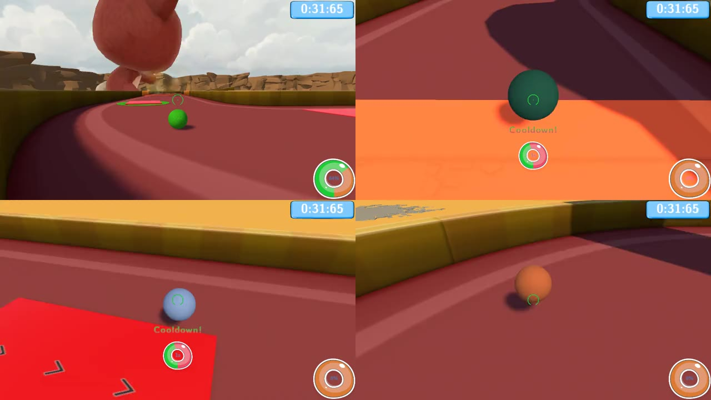
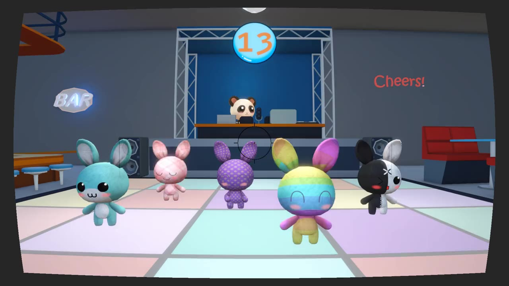
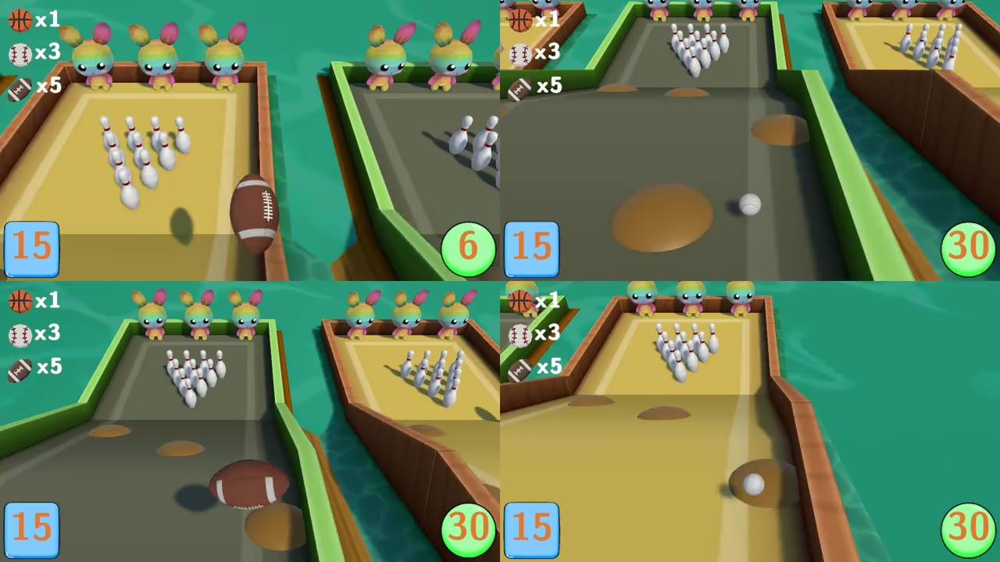

# Izzy's Island Party

**A local party collection of six mini-games for one to four players — against each other or against computer opponents.**
Final project of the Games Programming course at SAE Institute Hamburg · team of two · Unity 6 · Nov 2025 – Mar 2026.

| Minigolf Mayhem | Swaggy Snapshots | Bowling Battle |
|---|---|---|
|  |  |  |

Gameplay clips: [thinkshark.de – Izzy's Island Party](https://thinkshark.de/projekt-izzy.html)

## Team and split

| Mini-game | Built by |
|---|---|
| Minigolf Mayhem | Tjark Dreyer ([@DJTJ9](https://github.com/DJTJ9)) |
| Swaggy Snapshots | Tjark Dreyer |
| Bowling Battle | Tjark Dreyer |
| Fishing Frenzy | J. Albrecht ([@heyitsjudymoody](https://github.com/heyitsjudymoody)) |
| Jetski Joyride | J. Albrecht |
| Hasty Hurdles | J. Albrecht |

The game framework, menu, player management and the integration of all six games were built together. The ScriptableObject event system is mine.

**Built without coding agents or other AI help.** I wrote the code for my three games myself, from mechanics to computer opponents.

| | |
|---|---|
| **Stack** | Unity 6000.0.59f2 · C# · local multiplayer (controller or keyboard) |
| **Highlights** | own GOAP stack for NPCs · physics tuning · hand-keyframed animations · ScriptableObject events |

---

## My three games

### Minigolf Mayhem
Third-person minigolf where four players share the same course at the same time. The real opponent is the other balls: hit one and you send it flying.
- **Physics with game feel:** a shot has to feel weighty and controllable, and knocking a ball away has to pay off without ruining the round for the player who got hit. Tuned over many passes.
- **Computer opponents with GOAP:** a self-built stack (planner, agent, beliefs, goals, sensors, strategies — not an asset). NPCs plan their way to the hole, react to other balls and try to keep rivals from finishing quickly instead of playing the shortest line.

### Swaggy Snapshots
Animals dance on a disco floor; take the photo at the right moment. Every trait an animal fulfils in the shot — smiling, dancing well, looking into the camera — scores a point.
- **Dance animations by hand:** every dance is keyframed by hand in Unity's animation system.
- **Deliberately simple mechanic** to leave room for the animation work.

### Bowling Battle
Bowling with a choice of ball: each ball rolls better or worse and pays out more or fewer points per pin.
- **Four lanes, no divider:** a wildly bouncing ball can land on a neighbour's lane and score for them.
- **Balancing chance and skill** through tuning values — a bad-rolling ball has to pay off, the chaos must not make good play irrelevant.

## Shared foundation

- **ScriptableObject event system (mine):** an event is an asset; listeners hook in via the Inspector; sender and receiver never know each other. Clear shared interfaces let us work in parallel without rewriting each other's code.
- **Game framework (joint):** player selection, turn rotation and the score screen behave the same in every game; computer opponents fill empty seats.

## Project layout

| Path | Contents |
|---|---|
| `Assets/DevTjark/Scripts/Minigolf Mayhem/` | Minigolf Mayhem gameplay code |
| `Assets/DevTjark/Scripts/Minigolf Mayhem/GOAP/` | GOAP stack: planner, agent, actions, beliefs, goals, sensor, strategies |
| `Assets/DevTjark/Scripts/Swaggy Snapshots/` | Swaggy Snapshots gameplay code |
| `Assets/DevTjark/Scripts/Bowling Battle/` | Bowling Battle gameplay code |
| `Assets/DevTjark/Scripts/Scriptable Objects/` | ScriptableObject event system (`GameEvent`, generic events and listeners) |
| `Assets/DevBoth/` | Shared framework: scenes, UI, input, player joining, level loading |

## Open the project

Clone the repository and add the folder in Unity Hub (**Unity 6000.0.59f2**). The repo contains art assets and preview clips; its history is about 1.8 GB. For the source only:

```bash
git clone --filter=blob:none https://github.com/DJTJ9/IzzysIslandParty.git
```

## Branches

`main` holds the final submission (v1.0, March 2026). The `feature/*` branches document the development of the individual mini-games.

## What I learned

GOAP cost far more than budgeted — and paid off exactly where opponents have to react to things you cannot plan in advance; a fixed route would have read as a script. Randomness only improves a party game when everyone at the table can see it.
